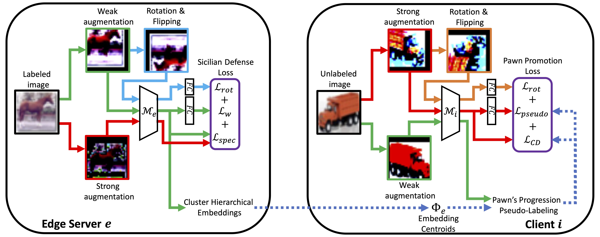

# CHESSFL: Clustering Hierarchical Embeddings for Semi-Supervised Federated Learning
## Allen-Jasmin Farcas, Myungjin Lee, Ali Payani, Ramana Rao Kompella, Hugo Latapie, Radu Marculescu

Contact: allen.farcas@utexas.edu

<div align="center">
  <figure>
    <a href="./">
      
    </a>
    <figcaption>Our proposed unified Semi-Supervised Hierarchical Federated Learning (SSHFL) evaluation 
framework. Edge servers (shown with orange border) have labeled data, while heterogeneous 
devices (shown with different colors, green, blue, red, purple) have their own local 
unlabeled data. Similar to classic HFL, we run steps 1 through 5 and evaluate the global 
model’s test accuracy after a given number of communication rounds.</figcaption>
  </figure>
</div>


<div align="center">
    <figure>
    <a href="./">
        
    </a>
    <figcaption>Our proposed CHESSFL framework initiates training on the edge server with labeled data, 
utilizing our novel Sicilian Defense Loss. The feature embeddings derived from weakly-augmented 
labeled images are clustered, and the embedding cluster centroids are then transmitted to the 
client. Following the implementation of the proposed Pawn’s Progression Pseudo-Labeling
the client starts training on unlabeled images using our novel Pawn Promotion Loss.
</figcaption>
  </figure>
</div>

## 1. Create the virtual environment
```bash
conda create -n chessfl python==3.10
conda activate mohawk
pip3 install torch torchvision torchaudio paramiko scp tqdm pandas
```

## 2. Prepare datasets
Run `python generate_dataset.py` to create the local datasets for all users.

## 3. Change paths
In `utils/general_utils.py` the function `get_hw_info` contains paths for the files. Change them accordingly.

You need to match the `hw_type` from `get_hw_info(hw_type)` with `device_type` from `experiments/exp.bash`.

## 4. Run experiments
Edit the experiment configuration `experiments/exp.bash`. Check the `generate_configs.py` for more details on 
the parameters used.

Run `bash experiments/exp.bash` to create the configuration.

Finally, run `bash scripts/execute_exp.bash` to run the experiment. You can edit this script to contain your desired
experiments to run.

## Citation
```
@inproceedings{farcas2024chessfl,
  title={CHESSFL: Clustering Hierarchical Embeddings for Semi-Supervised Federated Learning},
  author={Farcas, Allen-Jasmin and Lee, Myungjin and Payani, Ali and Kompella, Ramana Rao and Latapie, Hugo and Marculescu, Radu},
  booktitle={Proceedings of the 9th ACM/IEEE Conference on Internet of Things Design and Implementation},
  pages={122--133},
  year={2024}
}
```